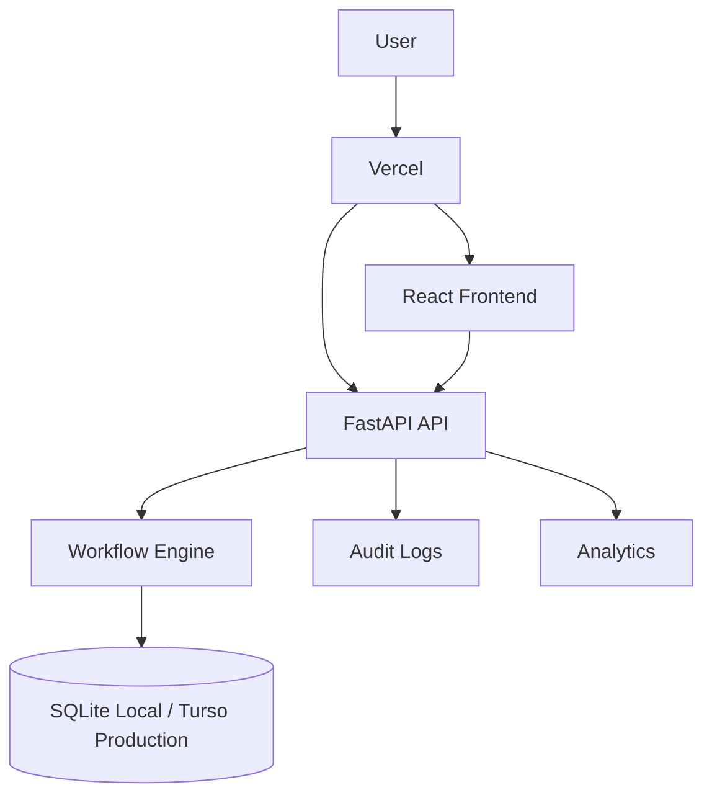

# FlowForge

**Visual Business Workflow Automation Platform**

FlowForge is a full-stack workflow automation platform that demonstrates how organizations can digitally design, execute, monitor, and audit internal approval processes. It is built as a professional portfolio project: realistic business logic, polished enterprise UI, clear architecture, tests, and Vercel-oriented deployment support.

## Overview

FlowForge replaces email threads, spreadsheets, paper forms, and informal follow-ups with a visual workflow system. Teams can publish workflows such as Purchase Requests, Leave Requests, IT Access Requests, and Equipment Requests, then run real requests through approvals, conditions, tasks, notifications, audit logs, and analytics.

The workflow builder is not just a diagramming tool. Published graphs are executed by backend service logic and persisted in the database so each workflow can resume safely across serverless API invocations.

## Demo Credentials

All demo accounts use:

```text
Demo123!
```

| Role | Email |
| --- | --- |
| Administrator | admin@flowforge.local |
| Workflow Designer | designer@flowforge.local |
| Manager | manager@flowforge.local |
| Employee | employee@flowforge.local |
| Auditor | auditor@flowforge.local |

## Features

- JWT authentication with bcrypt password hashing
- Role-based access control for Administrator, Workflow Designer, Manager, Employee, and Auditor
- User and department administration
- Visual workflow catalog and React Flow builder
- Workflow versioning with immutable published versions and editable drafts
- Backend workflow validation before publication
- Execution engine for Start, Form, Approval, Condition, Task, Notification, and End nodes
- Employee workflow launch, My Requests, request detail, and execution timeline
- Manager approval inbox with approve, reject, request-changes, and comments
- Manager task queue with start/complete actions and durable completion notes
- Internal notifications with unread counts, dropdown, notification page, and read/read-all actions
- Audit log model and read-only audit browser
- Analytics dashboard with execution totals, charts, recent activity, and bottleneck calculations
- Seeded fictional organization with 15+ users, 7 departments, 4 workflows, and demo activity
- SQLite local development with Turso/libSQL production configuration
- Vercel routing config for a single frontend/API deployment
- GitHub Actions CI for backend tests, frontend tests, and frontend build

## Workflow Builder

The builder uses React Flow with:

- Left node toolbox
- Full workflow canvas
- Right configuration panel
- Save, validate, and publish controls
- Mini-map, zoom, and fit controls
- TRUE/FALSE branch labels for condition nodes

Supported node types:

- Start
- Form
- Approval
- Condition
- Task
- Notification
- End

## Workflow Engine

The backend engine:

1. Loads the newest published workflow version.
2. Creates a workflow instance with a human-readable reference number.
3. Traverses graph nodes.
4. Validates submitted form data.
5. Pauses at approval and task nodes.
6. Resumes from persisted database state.
7. Evaluates structured condition rules.
8. Creates internal notifications.
9. Records workflow events and audit logs.
10. Completes, rejects, or cancels the instance at End nodes.

## Architecture



Local development:

```text
React/Vite -> FastAPI -> SQLite
```

Production target:

```text
Vercel React frontend + Vercel Python API -> Turso/libSQL
```

## Technology Stack

Frontend:

- React
- TypeScript
- Vite
- Tailwind CSS
- React Router
- TanStack Query
- React Flow
- Recharts
- Lucide React

Backend:

- Python
- FastAPI
- SQLAlchemy
- Pydantic
- JWT
- bcrypt
- SQLite
- Turso/libSQL via SQLAlchemy dialect for production

## Local Development

Copy the environment file:

```bash
cp .env.example .env
```

Windows PowerShell:

```powershell
Copy-Item .env.example .env
```

Backend:

```bash
cd backend
python -m venv venv
venv\Scripts\activate
pip install -r requirements.txt
python -m app.seed.seed_data
uvicorn app.main:app --reload
```

Frontend:

```bash
cd frontend
npm install
npm run dev
```

Local URLs:

- Frontend: `http://127.0.0.1:5173`
- Backend: `http://127.0.0.1:8000`
- API docs: `http://127.0.0.1:8000/docs`
- ReDoc: `http://127.0.0.1:8000/redoc`

## Testing

Backend:

```bash
cd backend
pytest
```

Frontend:

```bash
cd frontend
npm run test -- --run
npm run build
```

## Demo Data

Seed demo data:

```bash
cd backend
python -m app.seed.seed_data
```

Reset local demo data:

```bash
cd backend
python -m app.seed.reset_demo
```

The reset script is intentionally a local/admin script, not a public API endpoint.

## Production Deployment

FlowForge includes:

- `api/index.py` Vercel FastAPI entry point
- `vercel.json` for API and SPA routing
- Root `requirements.txt` for Vercel Python dependency discovery
- Turso/libSQL environment configuration

See [docs/deployment.md](docs/deployment.md) for the full deployment checklist.

## API Surface

Authentication:

- `POST /api/auth/login`
- `GET /api/auth/me`

Core resources:

- `/api/users`
- `/api/departments`
- `/api/workflows`
- `/api/instances`
- `/api/approvals`
- `/api/tasks`
- `/api/notifications`
- `/api/analytics/dashboard`
- `/api/analytics/workflows/{id}`
- `/api/audit-logs`

## Documentation

- [Architecture](docs/architecture.md)
- [Database](docs/database.md)
- [Workflow Engine](docs/workflow-engine.md)
- [Deployment](docs/deployment.md)
- [Screenshots](docs/screenshots/README.md)

## Screenshots

Screenshot placeholders live in `docs/screenshots/`. Capture real images after running the app locally or from the deployed Vercel demo.

Suggested captures:

- Login
- Dashboard
- Workflow Builder
- Purchase Request
- Approval Inbox
- Request Timeline
- Analytics
- Audit Logs

## Security Notes

- Demo credentials are for portfolio/demo use only.
- Never commit production secrets.
- `TURSO_AUTH_TOKEN` must remain backend-only.
- Frontend routes hide unavailable actions, but backend RBAC enforces permissions.
- Workflow conditions use structured operators only and do not execute arbitrary code.

## Limitations

- File attachments are intentionally not implemented in v1.
- Advanced scheduling, timers, and external notifications are out of scope.
- Production schema migration tooling is intentionally lightweight for this portfolio version.
- The React Flow bundle currently triggers a Vite large-chunk warning; the build still succeeds.

## License

MIT
