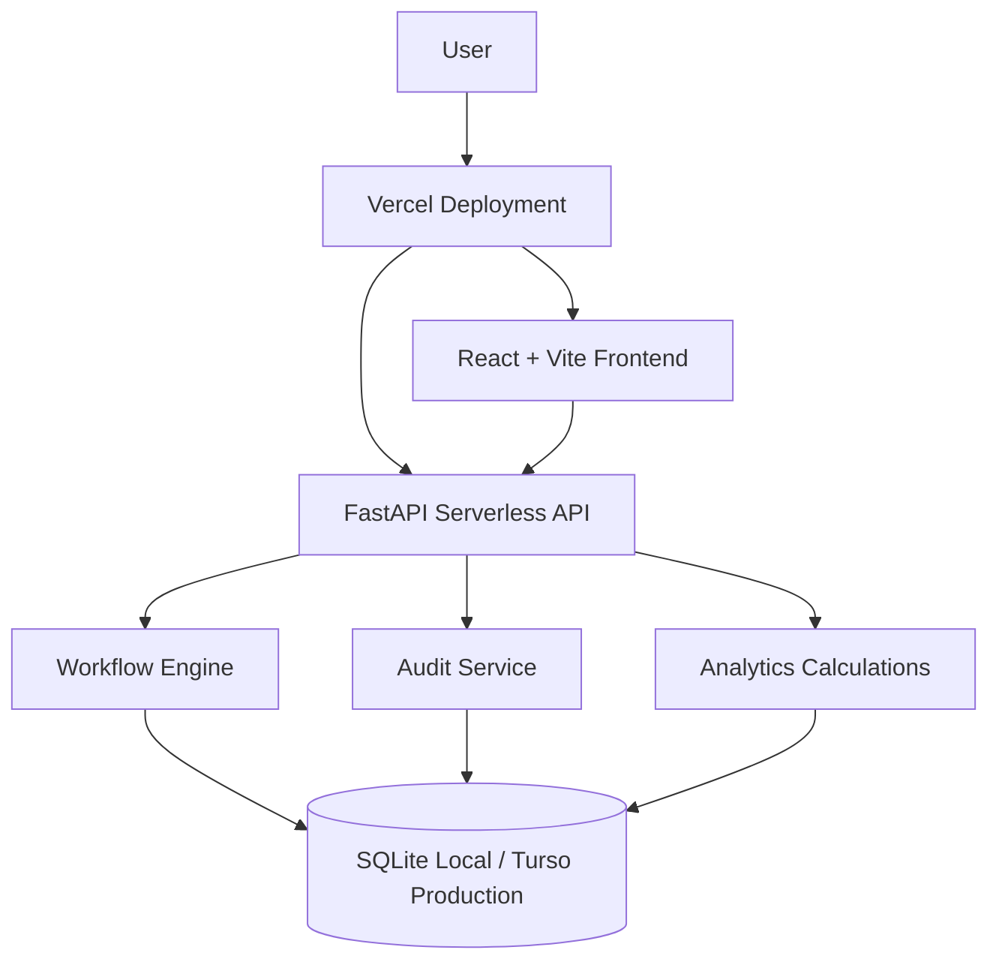

# Architecture

FlowForge uses one React frontend, one FastAPI backend, and one relational database.

## Frontend

The frontend is a Vite React application using TypeScript, Tailwind CSS, React Router, TanStack Query, React Flow, Recharts, and Lucide React.

Main areas:

- Authenticated application shell with role-aware navigation
- Workflow catalog and visual builder
- Employee request launch and tracking
- Manager approvals and tasks
- Notifications, analytics, and audit logs

## Backend

The backend is a FastAPI app under `backend/app`. Routes stay thin and call service-layer code for workflow execution, validation, audit logging, and notifications.

## Database

Local development uses SQLite. Production is configured for Turso/libSQL through SQLAlchemy using environment variables.

All workflow execution state is persisted in the database. The serverless API does not depend on in-memory queues, background workers, or writable production filesystem state.
