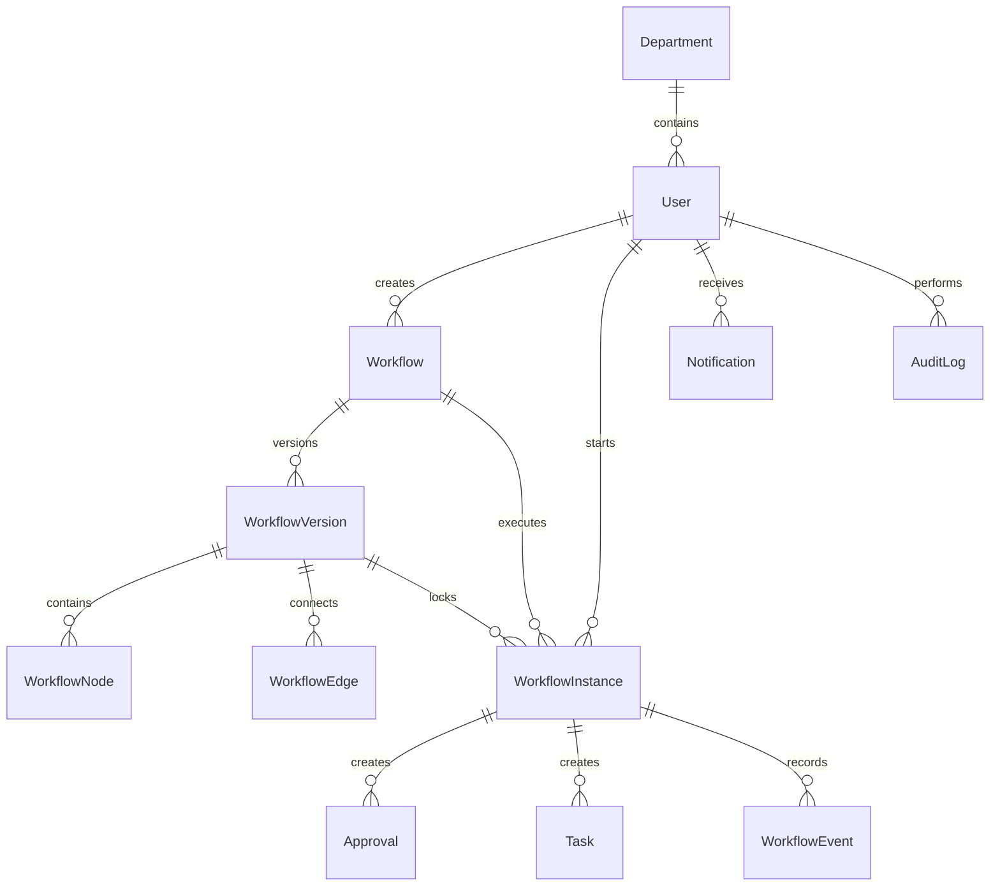

# Database

FlowForge stores workflow definitions, immutable versions, execution state, notifications, and audit records in SQLAlchemy models.

## Versioning

Published workflow versions are immutable. Editing a published workflow creates a new draft version. Existing workflow instances continue to use the version they started with. New instances use the newest published version.

## Execution State

`WorkflowInstance` stores the current node, current status, submitted form data, and timestamps. `Approval`, `Task`, and `Notification` rows represent human work and internal messages created during execution.

## History

`WorkflowEvent` powers request timelines and bottleneck analytics. `AuditLog` records user-visible system actions such as login, workflow publishing, request starts, approval decisions, and task completion.
